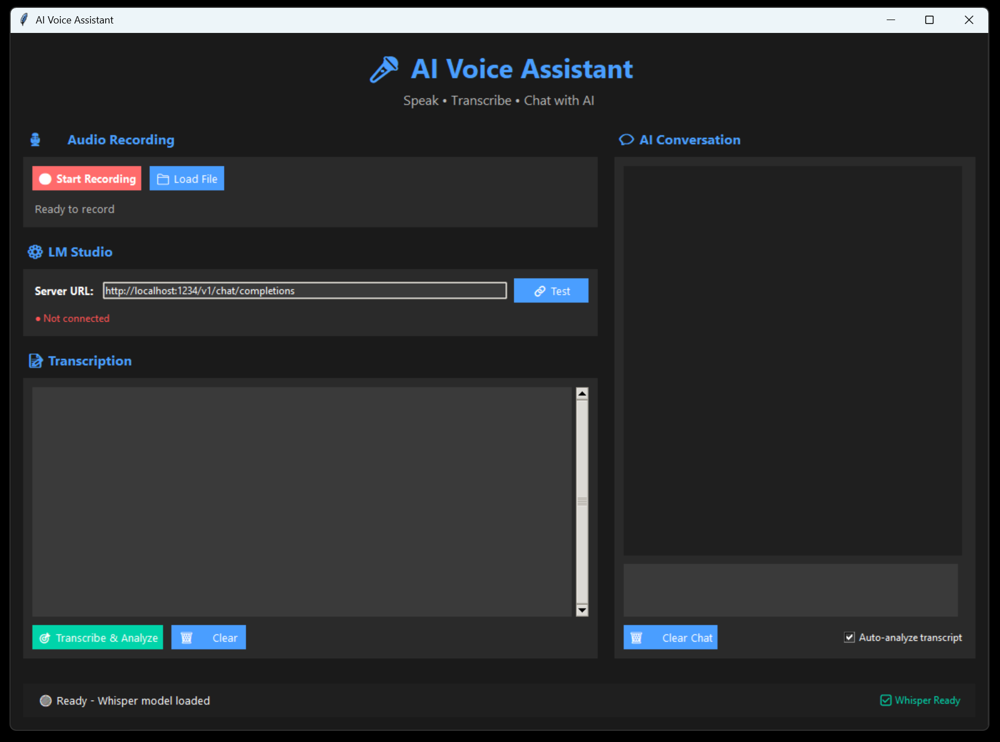

# 🎤 AI Voice Assistant

A powerful desktop application that combines voice recording, AI transcription, and intelligent chat capabilities. Record your voice, transcribe it using OpenAI's Whisper, and engage in focused conversations about your transcribed content using LM Studio.


## ✨ Features

- **🎙️ Audio Recording**: High-quality voice recording with real-time feedback
- **📝 Speech-to-Text**: Accurate transcription using OpenAI Whisper
- **🤖 AI Chat Integration**: Seamless integration with LM Studio for transcript analysis
- **💬 Contextual Conversations**: AI maintains full transcript context throughout discussions
- **🎨 Modern Dark UI**: Professional interface with responsive layout
- **⌨️ Smart Controls**: Enter to send, Shift+Enter for new lines
- **📁 File Support**: Load existing audio files (WAV, MP3, M4A, FLAC, OGG)

## 🚀 Quick Start

### Prerequisites

1. **Python 3.8+** installed on your system
2. **LM Studio** downloaded and running with a loaded model
3. **Microphone** access for voice recording

### Installation Options

#### Option 1: Download Executable (Recommended)
1. Go to [Releases](https://github.com/username/ai-voice-assistant/releases)
2. Download the latest version for your operating system
3. Extract and run the executable

#### Option 2: Install from Source
1. **Clone the repository**:
   ```bash
   git clone https://github.com/username/ai-voice-assistant.git
   cd ai-voice-assistant
   ```

2. **Set up development environment**:
   ```bash
   python scripts/setup_dev.py
   ```

3. **Or install manually**:
   ```bash
   # Create virtual environment
   python -m venv venv
   source venv/bin/activate  # On Windows: venv\Scripts\activate
   
   # Install dependencies
   pip install -r requirements.txt
   ```

4. **Run the application**:
   ```bash
   python main.py
   ```

#### Option 3: Install via pip (Future)
```bash
pip install ai-voice-assistant
ai-voice-assistant
```

## 🎯 How to Use

### Basic Workflow

1. **Start LM Studio** and load your preferred AI model
2. **Launch the Voice Assistant**
3. **Test Connection** to ensure LM Studio is accessible
4. **Record Audio** using the red record button
5. **Transcribe & Analyze** - AI automatically processes your speech
6. **Chat About Content** - Ask questions about your transcription

### Recording Audio

- Click **🔴 Start Recording** to begin
- Speak clearly into your microphone
- Click **⏹️ Stop Recording** when finished
- Audio is automatically saved and ready for transcription

### Transcription Options

- **Auto-analyze**: Automatically transcribes and sends to AI (default)
- **Manual mode**: Transcribe first, then ask specific questions
- **Load files**: Import existing audio files for transcription

### Chat Features

- **Enter**: Send message immediately
- **Shift+Enter**: Add new line in message
- **Use Text**: Insert transcription into chat input
- **Clear Chat**: Reset conversation history

## ⚙️ Configuration

### LM Studio Setup

1. Download and install [LM Studio](https://lmstudio.ai/)
2. Load your preferred language model
3. Start the local server (usually on `localhost:1234`)
4. Test connection in the Voice Assistant settings

### Default Settings

- **Server URL**: `http://localhost:1234/v1/chat/completions`
- **Whisper Model**: `base` (automatically downloaded)
- **Audio Format**: WAV, 44.1kHz, 16-bit
- **Auto-analysis**: Enabled by default

## 🎨 Interface Overview

### Left Panel (Controls)
- **🎙️ Audio Recording**: Record or load audio files
- **⚙️ LM Studio**: Connection settings and status
- **📝 Transcription**: View and manage transcribed text

### Right Panel (Chat)
- **💬 AI Conversation**: Full chat interface with conversation history
- **Message Input**: Multi-line text input with smart key bindings
- **Chat Controls**: Clear history and toggle auto-analysis

### Status Bar
- **System Status**: Current operation and connection status
- **Whisper Status**: Model loading and readiness indicator

## 🔧 Technical Details

### Dependencies

- **tkinter**: GUI framework (included with Python)
- **pyaudio**: Audio recording capabilities
- **wave**: Audio file processing
- **requests**: HTTP communication with LM Studio
- **openai-whisper**: Speech-to-text transcription
- **threading**: Background processing for smooth UI

### System Requirements

- **OS**: Windows (primary), macOS/Linux (compatible)
- **Python**: 3.8 or higher
- **RAM**: 4GB+ (for Whisper model)
- **Storage**: 1GB+ for Whisper models
- **Audio**: Microphone input device

### Performance Notes

- **First run**: Whisper base model (~150MB) downloads automatically
- **Transcription**: Processing time depends on audio length
- **AI Response**: Speed depends on LM Studio model and hardware

## 🎛️ Advanced Usage

### Custom System Prompts

The AI receives specialized prompts for transcript analysis:
- Focuses exclusively on transcribed content
- Provides summaries, insights, and analysis
- Identifies key points and action items
- Maintains conversation context

### Audio Quality Tips

- **Use a good microphone** for better transcription accuracy
- **Speak clearly** and at a moderate pace
- **Minimize background noise** during recording
- **Keep recordings under 10 minutes** for optimal processing

### Troubleshooting

**PyAudio Installation Issues**:
```bash
# Windows alternative
pip install pipwin
pipwin install pyaudio

# Or download wheel from: https://www.lfd.uci.edu/~gohlke/pythonlibs/#pyaudio
```

**LM Studio Connection Problems**:
- Verify LM Studio is running and server is started
- Check firewall settings for localhost access
- Ensure correct port (default: 1234)

**Transcription Accuracy**:
- Use higher quality audio input
- Consider upgrading to Whisper 'small' or 'medium' models
- Ensure stable system performance during processing

## 📁 File Structure

```
ai-voice-assistant/
├── main.py              # Complete application code
├── README.md            # This documentation
├── requirements.txt     # Python dependencies (optional)
└── temp/               # Temporary audio files (auto-created)
```

## 🤝 Contributing

We welcome contributions! Please see our [Contributing Guidelines](CONTRIBUTING.md) for details.

### Quick Start for Contributors

1. **Fork the repository**
2. **Set up development environment**:
   ```bash
   git clone https://github.com/yourusername/ai-voice-assistant.git
   cd ai-voice-assistant
   python scripts/setup_dev.py
   ```
3. **Make your changes**
4. **Run tests**: `python -m pytest`
5. **Submit a pull request**

### Areas for Improvement

Check out our [Improvement Roadmap](IMPROVEMENTS.md) for ideas:
- Additional audio format support
- Cloud AI service integration  
- Voice activity detection
- Conversation export features
- Multi-language support
- Performance optimizations

## 📄 License

This project is licensed under the MIT License - see the [LICENSE](LICENSE) file for details.

## 🔗 Links

- **Documentation**: [README](README.md)
- **Issues**: [GitHub Issues](https://github.com/username/ai-voice-assistant/issues)
- **Releases**: [GitHub Releases](https://github.com/username/ai-voice-assistant/releases)
- **Contributing**: [Contributing Guidelines](CONTRIBUTING.md)
- **Changelog**: [Release Notes](CHANGELOG.md)

## 🔗 Related Projects

- [OpenAI Whisper](https://github.com/openai/whisper) - Speech recognition model
- [LM Studio](https://lmstudio.ai/) - Local language model interface
- [PyAudio](https://people.csail.mit.edu/hubert/pyaudio/) - Audio I/O library

## 📞 Support

For issues and questions:
1. Check the troubleshooting section above
2. Verify all dependencies are correctly installed
3. Ensure LM Studio is properly configured
4. Test with simple, clear audio recordings

---

**Made with ❤️ for voice-powered AI interactions**